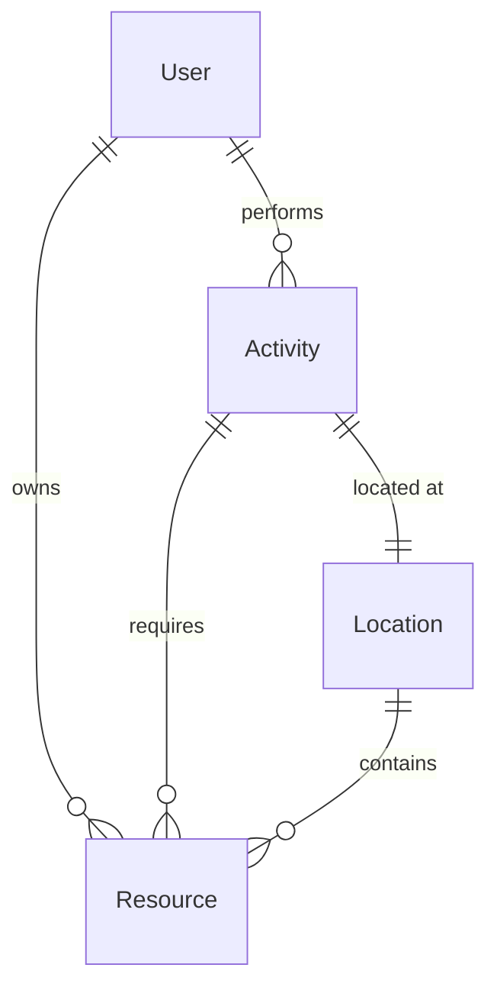

# Entities

This document outlines the core entities in the Tonville system.

## Core Entities

### User

- Represents a player in Tonville
- Contains profile information and game state
- Manages authentication and permissions

### Activity

- Represents actions players can take
- Includes rewards and requirements
- Links to economy system

### Resource

- In-game items and currencies
- Used in activities and trading
- Affects game economy

### Location

- Places in Tonville
- Contains available activities
- Influences gameplay mechanics

## Entity Relationships

## Data Models

Detailed data models and schemas can be found in our [database documentation](../architecture/database.md).
